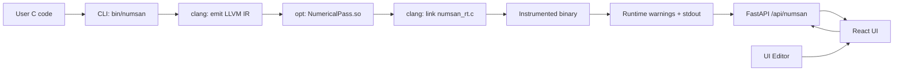

# DESIGN - Approach and Alternatives

## Problem Decomposition

The Numerical Sanitizer breaks into four sub-problems:

```
1. INSTRUMENTATION   - Insert checks at floating-point ops
2. RUNTIME CHECKS    - Compare float result vs double shadow
3. WRAPPER/PIPELINE  - Build, run pass, link runtime, execute
4. UI/UX             - Edit code, run, show warnings + output
```

## Architecture Diagram



---

## Design Decisions

### 1. Instrumentation: Function-Level IR Pass

**What we do:** A FunctionPass scans each function for float ops (`FAdd`, `FSub`, `FMul`, `FDiv`) and injects a call to `__numsan_check` right after each eligible instruction.

**Why a FunctionPass?**
- Each decision is local to a function
- The transformation is simple and deterministic
- Low overhead compared to whole-module analysis

**Line numbers:** We pass a source line number (when debug info is present) so the UI can highlight the exact line.

**Alternatives considered:**

| Approach | Pros | Cons | Why not used |
| --- | --- | --- | --- |
| FunctionPass (ours) | Simple, fast | No cross-function context | Good fit for localized checks |
| ModulePass | Can coordinate across functions | More complex | Not needed here |
| Loop/CGSCC pass | Can prioritize hot paths | Overkill | No profiling data |

### 2. Shadow Computation: Float -> Double Recompute

**What we do:** Promote both float operands to double, recompute the operation, and compare float result vs double shadow.

**Why double shadow?**
- Directly measures lost precision
- Cheap and stable baseline
- Easy to explain to users

**Threshold:** A relative error threshold of `1e-9` in the runtime check.

**Alternatives considered:**

| Shadow Type | Pros | Cons | Why not used |
| --- | --- | --- | --- |
| Double shadow (ours) | Simple, portable | Not exact | Acceptable tradeoff |
| Long double | Higher precision | Platform variance | Less predictable |
| MPFR / arbitrary precision | Most accurate | Heavy dependency | Too slow for demo |

### 3. Wrapper Pipeline: clang + opt + runtime

**What we do:** The `numsan` script compiles source to LLVM IR, runs the pass via `opt`, links the runtime, and produces a runnable binary.

**Why a wrapper script?**
- Keeps the workflow one command
- Avoids requiring users to know LLVM plumbing
- Easy to integrate with the UI backend

**Optimization level:** `-O0` to reduce constant-folding so float ops remain visible to the pass.

**Alternatives considered:**

| Pipeline | Pros | Cons | Why not used |
| --- | --- | --- | --- |
| `-O1`/`-O2` | Faster, smaller | Misses ops via folding | Hides the behavior we want |
| clang plugin | More integrated | More complex build | Not needed |

### 4. Runtime Reporting: Text-Based Warnings

**What we do:** Emit warnings to stdout with line number, float result, double shadow, and relative diff.

**Why text output?**
- Human-readable
- Easy to parse in the backend
- Works from CLI and UI

**Alternatives considered:**

| Output Format | Pros | Cons | Why not used |
| --- | --- | --- | --- |
| JSON | Structured | Needs extra parsing in C | Simpler to keep text |
| Logging file | Persistent | Extra file management | Not needed for demo |

### 5. UI + Backend: FastAPI + React

**What we do:** The UI sends code to `/api/numsan`, the backend writes it to a temp file, runs `numsan`, parses warnings, and returns both warnings and stdout.

**Why FastAPI?**
- Minimal code
- Fast to iterate
- Easy JSON IO

**Alternatives considered:**

| Backend | Pros | Cons | Why not used |
| --- | --- | --- | --- |
| Flask | Simple | Fewer built-in features | FastAPI is cleaner here |
| Node/Express | JS stack | More dependencies | Python already used |

---

## Ordering of Sub-Passes

```
[Compile to IR] → [Instrument] → [Link runtime] → [Execute] → [Parse warnings]
```

**Why this order?**
1. Instrumentation requires IR
2. Runtime must be linked after instrumentation
3. Warnings only exist after execution

---

## Alternatives to This Whole Approach

| Alternative | Description | Trade-off |
| --- | --- | --- |
| Use clang sanitizers | Built-in sanitizers | Not specialized for precision |
| Use LLVM SanitizerCoverage | Tracking ops | No precision comparison |
| Use dynamic binary instrumentation | No compiler changes | Much slower, more complex |

---

## Known Limitations

- Only float operations are instrumented (not double or vector types).
- Direct recursion is not a concern here, but large inlining or interprocedural work is not implemented.
- Debug info is required for line numbers; without `-g`, warnings show `line ?`.
- Constant folding can remove operations if optimizations are enabled.
